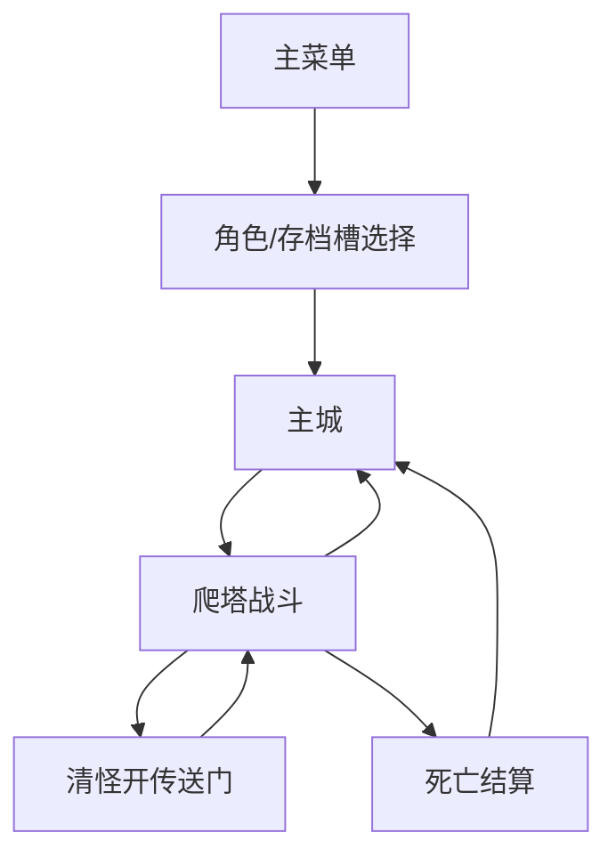

# 2D 暗黑爬塔 ARPG 设计汇总

## 一句话方向

一个 Godot 4.6.2 制作的 2D 暗黑刷宝/爬塔 ARPG。玩家从主城进入塔层，击杀敌人、拾取装备、强化角色、解锁技能和构筑 BD，最终形成可以反复游玩的爬塔循环。

## 当前项目边界

当前新项目是干净的 2D 项目，不继承旧 3D 场景和旧 POLYGON 资源。

当前优先级不是“系统全做满”，而是：

1. 稳定启动。
2. 稳定移动和攻击。
3. 稳定切场景。
4. 稳定保存角色状态。
5. 做出第一版可试玩 UI。
6. 再扩展职业、技能、装备、内容和视觉。

## 场景流程

当前场景：

- `MainMenu.tscn`：主菜单。
- `CharacterSelect.tscn`：职业选择和创建角色。
- `Town.tscn`：主城入口，显示当前角色和最高楼层。
- `Game2D.tscn`：2D 战斗和爬塔主循环。

目标流程：

## 核心玩法循环

当前已实现最小闭环：

1. 创建角色。
2. 从主城进入塔层。
3. 使用 WASD 或方向键移动。
4. 使用左键基础攻击。
5. 击杀敌人。
6. 敌人掉落物品。
7. 拾取进入背包数据。
8. 清怪后出现传送门。
9. 按 E 或进入传送门前往下一层。
10. 回城/死亡/进下一层时保存状态。

目标扩展闭环：

1. 主城管理背包、装备、仓库、商人、铁匠、技能树。
2. 进入塔层，完成楼层目标。
3. 获得装备、符石、金币、材料。
4. 回城整理装备和构筑。
5. 提升角色等级、技能树和转职方向。
6. 挑战更高层数、精英和 Boss。

## 职业设计

当前基础职业：

- 战士：近战、高生命、低法力，基础技能为顺劈斩。
- 游侠：远程投射物，中等生命和法力，基础技能为穿刺射击。
- 法师：远程法术，高法力、低生命，基础技能为奥术弹。
- 侍僧：召唤/骨系，中等生命和法力，基础技能为骨刺。

后续方向：

- 基础职业先行。
- 达到等级后转职。
- 同一大职业的分支可以共享装备池。
- 不同大职业之间装备不互通。
- 属性收益要有职业差异，但不要设计成明显的“好属性/坏属性”。

## 技能设计

当前技能规则位于：

- `scripts/rules/SkillRules.gd`
- `scripts/combat/Skill2DLibrary.gd`

当前技能：

- `warrior_cleave`：顺劈斩。
- `ranger_shot`：穿刺射击。
- `mage_bolt`：奥术弹。
- `bone_spike`：骨刺。
- `whirlwind_core`：旋风斩。

设计方向：

- 每个职业有基础技能、核心技能和后续分支。
- 技能树负责提供机制变化、范围、冷却、消耗、连锁、召唤数量等。
- 装备词条可以增强技能机制，但不直接给装备贴“适合某流派”的标签。
- 玩家通过技能树和装备词条自己研发 BD。

## 装备与词条设计

当前数据服务：

- `scripts/data/EquipmentDataService.gd`
- `scripts/rules/EquipmentAffixRules.gd`
- `scripts/rules/LootRules.gd`

当前已实现：

- 起始武器。
- 掉落装备。
- 装备槽规则。
- 大职业装备池检查。
- 装备属性汇总。

当前装备槽：

- `weapon`
- `armor`
- `gloves`
- `ring`

当前基础词条示例：

- `attack_damage`
- `max_health`
- `max_mana`
- `defense`
- `critical_chance`
- `projectile_count`
- `summon_damage`

后续词条规则：

- 投射物词条只进入弓、法术、部分远程机制装备，不进入战士刀剑。
- 召唤伤害优先进入侍僧/召唤相关装备。
- 防御、生命、抗性类词条可以更广泛。
- 技能机制词条应和装备类型、职业池、技能标签匹配。
- 装备不硬标“适合流派”，只提供可组合的词条。

## 符石设计

用户明确偏好：

- 符石不做复杂流派标签。
- 符石直接增加基础属性。
- BD 主要由装备词条和技能分支决定。

推荐符石方向：

- 力量符石：增加物理伤害或生命。
- 敏捷符石：增加攻速、移速、暴击。
- 智力符石：增加法力、法术伤害。
- 信仰/魂能符石：增加召唤伤害、持续时间或回复。
- 守护符石：增加护甲、抗性、生命。

## 背包、仓库、商人、铁匠 UI

设计目标：

- 成熟 ARPG/MMORPG 风格独立窗口。
- 类似魔兽式紧凑图标网格。
- 不做大卡片堆叠式布局。
- 背包格子要有稳定尺寸，不能因为文字或图标变化导致格子溢出。
- UI 要适配不同分辨率。

推荐窗口：

- 背包窗口：图标格子、数量、锁定、排序、筛选。
- 装备窗口：角色装备槽、属性汇总、装备详情、对比。
- 仓库窗口：更多格子、页签、搜索。
- 商人窗口：出售、买回、价格。
- 铁匠窗口：分解、强化、重铸、词条预览。
- 技能树窗口：基础职业、核心技能、转职分支。

## 存档设计

当前存档：

- 存档版本：`SAVE_VERSION = 1`
- 三个角色槽：`slot_1`、`slot_2`、`slot_3`
- 当前激活槽：`active_slot_id`
- 每个槽包含角色数据、仓库、货币、待领取奖励。

当前保存路径：

- `user://dark_tower_2d_save.json`

注意：

- 不要清除玩家存档，除非用户明确要求。
- 做存档迁移时要兼容旧字段。
- 测试尽量不要破坏已有存档。

## 技术架构

原则：

- 场景负责表现、输入、切换。
- 数据服务负责纯 Dictionary 数据规则。
- 战斗脚本只处理当前场景里的实体状态。
- 保存只在关键事件触发：创建角色、清层、进入下一层、回城、死亡、拾取延迟保存。

主要分层：

- `scripts/app`：场景流程和入口。
- `scripts/combat`：玩家、敌人、掉落、技能释放、轻量特效。
- `scripts/data`：玩家、背包、装备、塔层进度数据服务。
- `scripts/rules`：职业、技能、装备词条、掉落规则。
- `scripts/save`：存档结构和读写。
- `scripts/ui`：HUD 和后续窗口控制器。

## 已知限制

当前版本只是最小可玩骨架：

- 角色选择 UI 还很简陋。
- 主城只是入口，不是完整功能城镇。
- 背包还没有独立窗口。
- 装备还没有可视化穿脱窗口。
- 技能树还没有 UI。
- 敌人类型少。
- 楼层节奏单一。
- 美术和特效是程序化占位。
- 未加入音效、动画、Boss、精英词缀。

## 近期最高优先级

1. 做可用的角色/存档槽选择界面。
2. 做背包图标网格窗口。
3. 做装备窗口和装备穿脱。
4. 做战斗内暂停、回城和死亡结算。
5. 增加连续爬塔稳定性测试。
6. 做 3 到 5 个楼层节奏变化。
