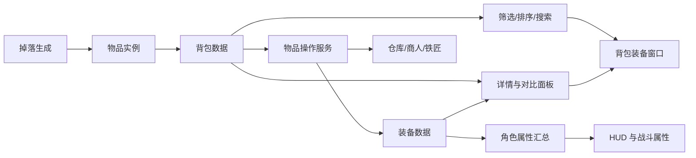

# 背包与装备系统交付级设计规格

日期：2026-06-09  
适用项目：`dark-tower-2d-arpg`  
目标阶段：P2 可稳定试玩 UI 与核心刷宝体验

## 设计目标

背包与装备系统要从“能存物品”升级到“玩家能可靠判断、整理、穿脱、保留和处理装备”的交付级系统。它不是单独的 UI 面板，而是暗黑刷宝循环的中枢：拾取、判断、穿戴、比较、整理、回城处理、继续爬塔。

交付标准不是追求复杂，而是追求清晰、稳定、可扩展：

- 玩家打开背包时游戏必须暂停，不能因为整理装备被怪物击杀。
- 玩家必须能在 3 秒内判断一件装备是否值得看，10 秒内完成穿脱和比较。
- 所有装备必须有清晰的稀有度、部位、等级/强度、主属性、词缀、来源和可装备状态。
- 背包、装备、仓库、商人、铁匠、掉落过滤要共享同一套物品数据和展示规则。
- 不清除玩家存档；任何数据结构变化都通过版本迁移兼容旧存档。
- UI 采用项目当前暗黑 ARPG 界面方向，参考暗黑破坏神 4 的信息层级与面板密度，但美术仍保持我们自己的“冷峻通天塔”世界观。
- 图标、人物和装备表现保留正式素材接口，不把代码生成图形当作最终素材方案。

## 外部资料提炼

这份设计参考了几类成熟 ARPG 的公开资料，并转成我们项目能落地的原则。

### 暗黑破坏神 4：容易理解，但有深度

Blizzard 在《Diablo IV》物品设计文章中强调，词缀应当是角色强度的重要部分，并在装备选择时制造有意义的取舍；同时用攻击/防御等直观指标让新玩家先快速判断大方向，再让进阶玩家研究词缀组合。Season 4 Loot Reborn 进一步把掉落装备改成更容易判断升级，减少词缀数量但提高单条词缀影响力，并把复杂定制放到后续打造系统中。

对本项目的落地：

- P2 阶段每件装备先控制在“1 个主强度 + 2 到 4 条核心词缀”，避免满屏小字。
- 每个装备显示一个粗略强度分：武器偏伤害，护甲偏生存，戒指/手套偏机制和资源。
- 对比面板同时显示“总评分变化”和“关键词缀变化”，不能只给一个分数。
- 掉落数量宁可少一些，但每件装备都要让玩家能读懂它为什么存在。

### Grim Dawn：角色窗口和穿脱交互要直觉化

Grim Dawn 的角色窗口把装备槽和背包放在同一角色管理界面里，装备可以右键穿戴，也可以拖放到合适槽位；当背包扩容时，额外背包页会按按钮访问。

对本项目的落地：

- 背包和装备应该是同一窗口内的左右结构：左侧角色装备与属性摘要，右侧紧凑图标网格。
- 支持右键快速装备/卸下，支持拖放到装备槽，失败时给出明确原因。
- 支持背包页/仓库页扩展，但每页格子固定尺寸，避免文字撑开布局。

### Last Epoch：词缀、打造材料和过滤规则要可长期管理

Last Epoch 的物品系统围绕词缀、碎片、符文、雕文和打造潜力组织，玩家可以通过过滤和打造把刷宝目标收束到自己关心的属性。它的经验对我们更适合放到 P3/P4，而不是 P2 一口气做完。

对本项目的落地：

- P2 先把物品实例、词缀、装备槽、比较规则做稳定。
- P3 再做铁匠、分解、材料仓库、词缀强化和重铸预览。
- P4 再做掉落过滤：按稀有度、部位、强度、必要词缀、可选词缀、特殊装备标记来高亮或隐藏。

## 核心系统边界

### 物品实例

每件物品必须有稳定实例 ID，避免排序、存档、穿脱时丢失或覆盖。

建议字段：

- `instance_id`：唯一实例 ID。
- `base_id`：基础物品 ID，例如 `iron_sword_01`。
- `item_type`：武器、护甲、手套、戒指、材料、消耗品。
- `equipment_slot`：可装备槽位，材料和消耗品为空。
- `rarity`：普通、魔法、稀有、史诗、传说。
- `item_power`：大方向强度，用于快速判断。
- `required_level` / `required_class_tags`：装备条件。
- `implicit_stats`：基础属性。
- `affixes`：词缀列表，包含词缀 ID、数值、层级、是否强化。
- `binding_flags`：锁定、收藏、废品标记、不可出售等。
- `icon_id`：正式素材接口，UI 不直接依赖程序绘制图标。
- `source_tags`：掉落来源、楼层区间、怪物类型，用于后续追踪和掉落过滤。

### 装备槽

P2 推荐扩到以下槽位，但可以分两步落地：

- 必做：`weapon`、`armor`、`gloves`、`ring_1`、`ring_2`
- P3：`helmet`、`boots`、`amulet`、`relic`
- P4：副武器组、特殊遗物、套装槽

当前项目已有 `weapon`、`armor`、`gloves`、`ring`，升级时要写兼容迁移：旧 `ring` 自动放入 `ring_1`，`ring_2` 为空。

### 词缀与评分

装备评分不是唯一答案，只负责让玩家先看懂“这件东西大概值不值得读”。最终判断必须回到词缀。

评分分层：

- `base_power_score`：基础强度，来自物品等级、稀有度、部位。
- `role_score`：按职业和当前技能标签计算的粗略适配。
- `survival_score`：生命、防御、抗性、回复等。
- `damage_score`：攻击、暴击、技能伤害、召唤伤害等。
- `utility_score`：移动、资源、冷却、拾取便利等。
- `compare_delta`：与当前槽位装备对比后的变化。

评分输出必须附带解释，例如：

- `+12% 总伤害，-8 最大生命`
- `获得 projectile_count，但失去 critical_chance`
- `职业不可用`
- `等级不足`
- `戒指 2 槽为空，推荐装备`

### 物品操作

P2 必须支持：

- 右键快速装备。
- 右键卸下。
- 拖放到合适装备槽。
- 槽位不匹配时拒绝并提示。
- 装备替换时旧装备回到背包；如果背包满，操作失败并提示。
- 锁定/解锁。
- 收藏/取消收藏。
- 标记废品/取消废品。
- 按类型、稀有度、强度、最新获得排序。
- 按可装备、推荐升级、废品、收藏筛选。
- 鼠标悬停显示详情。
- 按住比较键或默认显示当前装备对比。

P3 支持：

- 仓库存取。
- 商人出售、买回。
- 铁匠分解。
- 批量出售/分解废品。
- 材料进入专用材料仓库，不占普通背包。

P4 支持：

- 掉落过滤。
- 按构筑保存过滤规则。
- 在地面掉落、背包、仓库、商人界面共享高亮规则。

## UI 结构

P2 背包装备窗口建议采用“暗黑 ARPG 角色管理面板”结构：

- 左栏：角色装备槽、战斗摘要、生命/魔力/伤害/防御核心属性。
- 中栏：当前选中物品详情和装备对比。
- 右栏：背包图标网格、页签、排序、筛选、容量。
- 底栏：锁定、收藏、废品、整理、关闭、回城后处理入口。

窗口打开规则：

- 战斗中打开背包时暂停游戏。
- 主城打开背包不需要暂停，但仍保持输入焦点，避免角色误移动。
- 死亡结算界面不能直接操作装备，只能查看摘要，避免状态混乱。

视觉规则：

- 图标格子尺寸固定，推荐 48 到 56 像素。
- 稀有度用边框和小角标表达，不靠大段文字。
- 装备变化用绿色/红色数值表达，但必须同时保留文字解释，避免色盲玩家读不懂。
- 面板文字不允许裁切；属性列表超长时滚动，不压缩格子。
- 使用项目统一 `DarkArpgUiTheme`，不在单个窗口里发明一套新样式。

## 存档与安全

背包和装备是高风险系统，任何变更都要优先保证不丢物品。

规则：

- 每次保存前校验：已装备物品和背包物品的 `instance_id` 不能重复。
- 每次穿脱后校验：物品总数等于操作前总数，除非明确发生出售、分解或丢弃。
- 增加存档版本迁移，不覆盖旧字段。
- 新字段必须有默认值，旧存档加载后也能打开背包。
- 自动测试不得写入真实玩家存档；使用测试路径或纯数据服务。

## 阶段拆分

### P2.1 数据稳定层

目标：先让背包容量、物品实例、装备槽、比较摘要稳定，避免继续堆 UI 时数据不稳。

交付：

- 物品实例字段统一。
- 背包容量摘要统一。
- 旧戒指槽迁移到 `ring_1`。
- 装备替换不丢物品。
- 所有推荐/对比服务使用同一套评分输出。

### P2.2 背包装备窗口

目标：让玩家可以真正管理装备。

交付：

- 战斗中打开背包自动暂停。
- 左装备、右背包、中对比的完整窗口。
- 右键装备/卸下、拖放、锁定、收藏、废品标记。
- 筛选、排序、容量提示。
- 鼠标悬停详情和当前装备对比。

### P2.3 试玩验收层

目标：让 10 到 30 分钟刷宝流程中，玩家能稳定获得、判断和处理装备。

交付：

- 10 分钟刷宝验收：至少 12 件掉落，玩家能保留、穿戴、标废品。
- 30 分钟稳定验收：不丢物品、不出现楼层异常跳高、不因 UI 导致战斗死亡。
- UI 在 1280x720、1600x900、1920x1080 下无裁切。

### P3 仓库、商人、铁匠

目标：把背包压力转化为城镇整理玩法，而不是让玩家反复丢弃。

交付：

- 仓库页签和搜索。
- 商人出售、买回。
- 铁匠分解和材料仓库。
- 批量处理废品。
- 强化/重铸预览，不直接随机吞物品。

### P4 掉落过滤与构筑目标

目标：当掉落复杂度上升时，让玩家能控制信息噪音。

交付：

- 过滤条件：稀有度、部位、强度、必要词缀、可选词缀、特殊标记。
- 高亮、显示、隐藏三种结果。
- 一键暂时关闭过滤。
- 地面掉落、背包、仓库、商人界面规则一致。

## 验收标准

### 玩家体验验收

- 战斗中打开背包，游戏立即暂停，关闭后恢复。
- 玩家能在 3 秒内识别稀有度、部位、可装备状态和是否推荐。
- 玩家能在 10 秒内完成“查看掉落 → 对比当前装备 → 装备或标废品”。
- 背包满时，拾取、装备替换、卸下都有清晰提示，不丢物品。
- 装备窗口不会遮住死亡结算、传送门提示、关键 HUD 信息。

### 数据验收

- 旧存档可加载。
- 旧 `ring` 字段迁移后不丢失。
- 任意穿脱、排序、筛选、锁定、收藏操作后，物品总数保持正确。
- 装备替换失败时状态完全回滚。
- 测试脚本不清除真实玩家存档。

### UI 验收

- 1280x720、1600x900、1920x1080 下文字不裁切、不重叠。
- 图标格子不会因为名称、数量、稀有度变化而变形。
- 鼠标悬停详情不超出屏幕。
- 颜色不是唯一信息来源；推荐/不可用/危险操作都有文字说明。

### 自动化验收

- `regression_inventory_capacity_rules.gd`
- `regression_equipment_slot_migration.gd`
- `regression_inventory_equipment_actions.gd`
- `regression_item_compare_summary.gd`
- `regression_inventory_window_responsive_bounds.gd`
- `regression_save_inventory_integrity.gd`
- 完整回归通过并输出 `ALL_NEW_PROJECT_REGRESSION_OK`

## 制作流程

1. 数据契约先行：定义物品实例、装备槽、词缀、容量、锁定/收藏/废品标记。
2. 写纯数据服务测试：先证明穿脱、替换、迁移、不丢物品。
3. 接入 UI 展示：只读展示背包、装备、对比、容量。
4. 接入操作：右键、拖放、锁定、收藏、废品。
5. 做视觉 QA：截图检查三种分辨率和战斗暂停状态。
6. 做 10 分钟刷宝验收：记录掉落、穿脱、整理、回城处理是否顺畅。
7. 再进入仓库/商人/铁匠，避免 P2 窗口还没稳定就扩大系统面。

## 暂不做

- 不在 P2 做完整传奇特效库。
- 不在 P2 做复杂打造随机池。
- 不在 P2 做套装系统。
- 不在 P2 做多角色共享仓库经济。
- 不使用代码生成图标作为最终素材，只保留素材接口和临时占位。

## 参考资料

- [Blizzard：System Design in Diablo IV Part II](https://news.blizzard.com/en-gb/article/23230076/system-design-in-diablo-iv-part-ii)
- [Blizzard：Diablo IV Season 4 Loot Reborn](https://news.blizzard.com/en-us/article/24077223/galvanize-your-legend-in-season-4-loot-reborn)
- [Blizzard：Diablo IV Loot Filter 规则说明](https://news.blizzard.com/en-us/article/24267729/prepare-for-the-reckoning-lord-of-hatred-draws-near)
- [Grim Dawn：Character Basics](https://www.grimdawn.com/guide/character/character-basics/)
- [Last Epoch：Items & Loot](https://lastepoch.com/items/)

