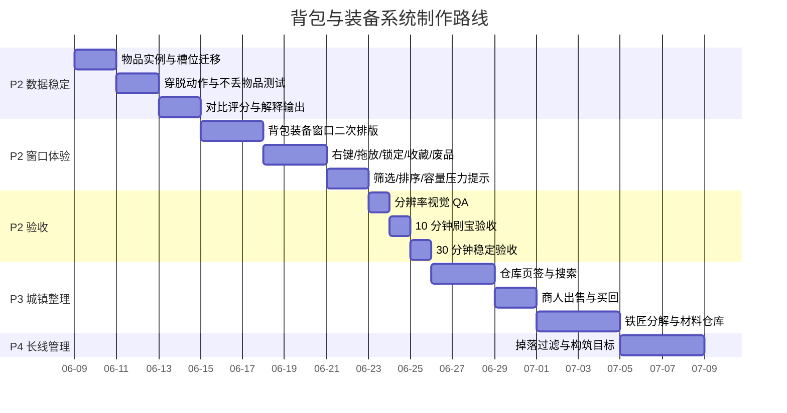

# 背包与装备系统交付路线图

日期：2026-06-09  
关联设计：`docs/design/2026-06-09-inventory-equipment-shippable-system-design.md`  
路线图定位：P2 试玩体验主线，后续衔接 P3 仓库/商人/铁匠与 P4 掉落过滤

## 总览

> 日期是制作节奏占位，不是硬性日历承诺。真正开工时以当前分支、回归状态和美术资源进度重新排期。

## 阶段工作表

| ID | 阶段 | 工作内容 | 产出物 | 验收标准 | 推荐测试 |
|---|---|---|---|---|---|
| IE-010 | P2.1 数据稳定 | 统一物品实例字段；补齐 `instance_id`、`item_power`、`binding_flags`、`icon_id`、`source_tags` | 物品数据契约文档；数据服务更新 | 旧物品可迁移，新物品可保存，排序后实例不丢失 | `regression_inventory_item_schema.gd` |
| IE-020 | P2.1 数据稳定 | 装备槽从 `ring` 迁移到 `ring_1`/`ring_2`；定义槽位匹配规则 | 槽位规则服务；存档迁移 | 旧 `ring` 自动进入 `ring_1`；不可装备物品有明确原因 | `regression_equipment_slot_migration.gd` |
| IE-030 | P2.1 数据稳定 | 穿戴、卸下、替换、失败回滚；背包满保护 | 物品操作服务 | 任意操作前后物品总数正确；背包满时不吞装备 | `regression_inventory_equipment_actions.gd` |
| IE-040 | P2.1 数据稳定 | 装备评分与解释摘要：伤害、生存、资源、机制 | 对比摘要服务 | 推荐不是黑箱分数，必须给出 1 到 3 条原因 | `regression_item_compare_summary.gd` |
| IE-050 | P2.2 窗口体验 | 背包装备窗口二次排版：左装备、中对比、右网格 | UI 场景/脚本更新 | 1280x720 不裁切；图标格尺寸稳定 | `regression_inventory_window_responsive_bounds.gd` |
| IE-060 | P2.2 窗口体验 | 战斗中打开背包暂停；关闭恢复；主城不误触移动 | 输入与暂停状态接入 | 打开背包不会被怪打死；关闭后战斗继续 | 场景烟测 + 手动试玩 |
| IE-070 | P2.2 窗口体验 | 右键装备/卸下、拖放、锁定、收藏、废品标记 | 完整交互链 | 10 秒内完成查看、对比、穿戴或标废品 | `regression_inventory_equipment_actions.gd` |
| IE-080 | P2.2 窗口体验 | 筛选、排序、容量压力提示 | 筛选排序 UI | 可按可装备、推荐、收藏、废品、稀有度筛选 | `regression_inventory_query_rules.gd` |
| IE-090 | P2.3 试玩验收 | 10 分钟刷宝验收 | QA 记录 | 至少 12 件掉落；玩家能有效整理装备；没有 UI 导致死亡 | `docs/qa/` 新增验收记录 |
| IE-100 | P2.3 试玩验收 | 30 分钟稳定验收 | QA 记录 | 不丢物品；楼层不异常跳高；无软锁；无残留测试进程 | 完整回归 + 手动 soak |
| IE-110 | P3 城镇整理 | 仓库页签、搜索、存取 | 仓库窗口 | 仓库不占背包；存取不丢实例 | `regression_stash_storage_rules.gd` |
| IE-120 | P3 城镇整理 | 商人出售、买回、批量卖废品 | 商人窗口 | 锁定/收藏装备不能误卖；买回列表可靠 | `regression_vendor_buyback_rules.gd` |
| IE-130 | P3 城镇整理 | 铁匠分解、材料仓库、强化预览 | 铁匠窗口 | 分解前预览收益；确认后才消耗物品 | `regression_blacksmith_salvage_rules.gd` |
| IE-140 | P4 长线管理 | 掉落过滤：显示、高亮、隐藏、临时关闭 | 掉落过滤服务和 UI | 按稀有度、部位、强度、必要词缀过滤；规则顺序可解释 | `regression_loot_filter_rules.gd` |

## P2 必须通过的阶段门

### Gate A：数据安全

通过条件：

- 旧存档可加载。
- `ring` 到 `ring_1` 迁移不丢物品。
- 穿戴、卸下、替换、失败回滚都不改变物品总数。
- 背包满时不会吞掉已装备物品。

未通过时不能进入 UI 大改。

### Gate B：窗口可用

通过条件：

- 战斗中打开背包自动暂停。
- 关闭背包后恢复战斗。
- 右键和拖放都可完成装备操作。
- 详情和对比面板不遮挡关键按钮。
- 三种分辨率无文字裁切。

未通过时不能扩大到仓库、商人、铁匠。

### Gate C：试玩闭环

通过条件：

- 10 分钟刷宝中，玩家能获得、判断、装备、标记和整理装备。
- 至少一次背包满或接近满的压力场景有清晰提示。
- 没有 UI 打开期间被怪击杀的问题。
- 没有楼层异常跳高、死亡后状态混乱、返回主城装备丢失问题。

通过后才进入 P3 城镇整理系统。

## 制作顺序

1. 先做 IE-010 到 IE-040：数据契约、槽位迁移、穿脱安全、对比解释。
2. 再做 IE-050 到 IE-080：窗口排版、暂停状态、交互、筛选排序。
3. 再做 IE-090 到 IE-100：10 分钟和 30 分钟验收。
4. P2 验收通过后再做 IE-110 到 IE-130：仓库、商人、铁匠。
5. 最后做 IE-140：掉落过滤和构筑目标。

## 视觉与素材接口

- 背包格、装备槽、稀有度边框可以先用 UI 主题和占位图标承载，但接口必须按 `icon_id` 读取正式素材。
- 不新增代码生成装备图标作为最终素材。
- 每种装备部位至少预留：普通图标、稀有度边框、不可用遮罩、锁定/收藏/废品小角标。
- 后续 IMAGE2 或正式美术导入时，只替换资源表，不改背包逻辑。

## 文档更新要求

每完成一个阶段，更新：

- `docs/progress/YYYY-MM-DD-*.md`：记录完成内容、验证命令、风险。
- `docs/qa/YYYY-MM-DD-*.md`：记录手动验收和截图观察。
- `docs/planning/`：若阶段门状态变化，更新路线图表。

